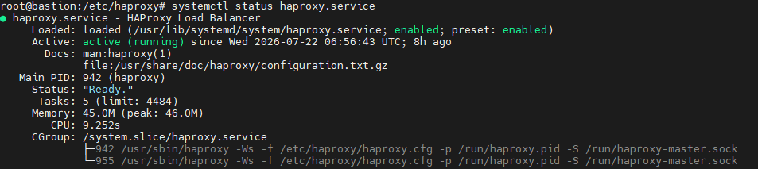
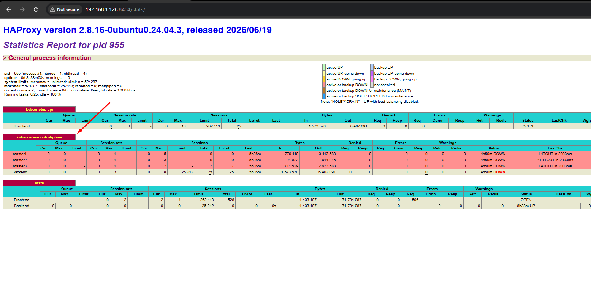
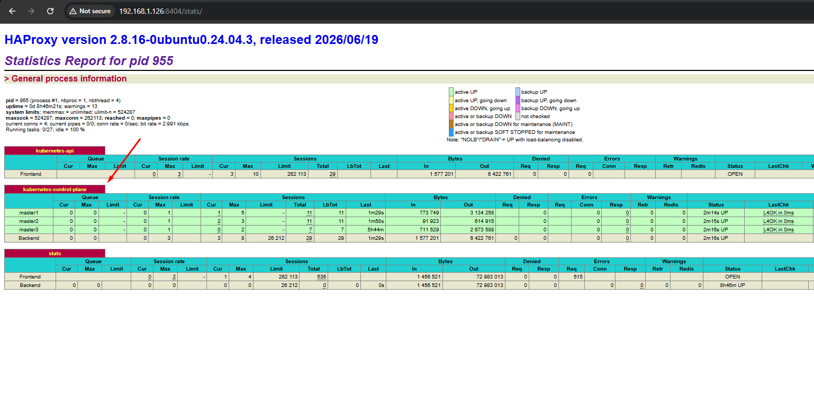

Dalam merancang mekanisme HA (High Availibility) untuk control-plane cluster kubernetes diperlukan mekanisme load Balancing untuk trafik yang masuk ke node control-plane dan salah satu software yang bisa kita gunakan secara gratis adalah Haproxy. Haproxy adalah software open source yang biasa digunakan sebagai **Load Balancer** dan **reverse proxy**. Namun pada kebutuhan kali ini haproxy ditujukan sebagai load balancer untuk cluster Kubernetes.

Tujuan dari kegiatan ini adalah melakukan load balancing terhadap traffic yang masuk ke **API cluster Kubernetes** yang berjalan di node Control-Plane atau biasa kita sebut master node, sehingga service API Cluster tetap dapat diakses jika salah satu service API pada salah satu node control-plane mati.

Berikut adalah step untuk untuk install dan setup untuk kebutuhan kali ini.

## Requirement : 
- OS Ubuntu server 24.04 LTS
- Memory 4 GB
- CPU 2 GB
- Internet Akses

## Table of Contents

1. [Requirement](#requirement)
2. [Install HAproxy](#install)
3. [Config haproxy.cfg](#object)
4. [Ringkasan](#ringkasan)

---

## Install

Sebelum menginstall paket haproxy pastikan server sudah bisa akses internet karena saya menggunakan online repository bawaan.
ssh ke server dan eksekusi command berikut untuk mulai menginstall paket sekaligus **enable** service agar autostart saat server booting.
```yaml
apt install haproxy -y
systemctl enable haproxy
```
pastikan service sudah dalam status aktif.


## Setup Config

Backup file /etc/haproxy/haproxy.cfg sebelum kita edit, kemudian buka file haproxy.cfg bisa menggunakan editor vim, nano, atau vi. Edit isi file sesuai dengan konfigurasi berikut.

```yaml
global
        log /dev/log    local0
        log /dev/log    local1 notice
        chroot /var/lib/haproxy
        stats socket /run/haproxy/admin.sock mode 660 level admin
        stats timeout 30s
        user haproxy
        group haproxy
        daemon

        # Default SSL material locations
        ca-base /etc/ssl/certs
        crt-base /etc/ssl/private

        # See: https://ssl-config.mozilla.org/#server=haproxy&server-version=2.0.3&config=intermediate
        ssl-default-bind-ciphers ECDHE-ECDSA-AES128-GCM-SHA256:ECDHE-RSA-AES128-GCM-SHA256:ECDHE-ECDSA-AES256-GCM-SHA384:ECDHE-RSA-AES256-GCM-SHA384:ECDHE-ECDSA-CHACHA20-POLY1305:ECDHE-RSA-CHACHA20-POLY1305:DHE-RSA-AES128-GCM-SHA256:DHE-RSA-AES256-GCM-SHA384
        ssl-default-bind-ciphersuites TLS_AES_128_GCM_SHA256:TLS_AES_256_GCM_SHA384:TLS_CHACHA20_POLY1305_SHA256
        ssl-default-bind-options ssl-min-ver TLSv1.2 no-tls-tickets

defaults
        log     global
        mode    tcp
        option  httplog
        option  dontlognull
        timeout connect 5000
        timeout client  50000
        timeout server  50000
        errorfile 400 /etc/haproxy/errors/400.http
        errorfile 403 /etc/haproxy/errors/403.http
        errorfile 408 /etc/haproxy/errors/408.http
        errorfile 500 /etc/haproxy/errors/500.http
        errorfile 502 /etc/haproxy/errors/502.http
        errorfile 503 /etc/haproxy/errors/503.http
        errorfile 504 /etc/haproxy/errors/504.http

frontend kubernetes-api
    bind 192.168.1.126:6443
    mode tcp
    default_backend kubernetes-control-plane

backend kubernetes-control-plane
    mode tcp
    balance roundrobin
    option tcp-check

    server master1 192.168.1.121:6443 check
    server master2 192.168.1.122:6443 check
    server master3 192.168.1.123:6443 check

listen stats
    bind *:8404
    mode http
    stats enable
    stats uri /stats
    stats refresh 10s

```
**Poin penting** karena konfigurasi tersebut adalah gabungan dari konfigurasi default, maka hal yang mungkin berbeda adalah konfigurasi **Global** dan **Defaults**, Pastikan untuk konfigurasi **frontend**, **backend** dan **listen stats** sudah sesuai. Kemudian untuk IP bisa dirubah sesuai pemakaian IP yang akan digunakan pada node control-plane.

Berikut adalah IP yang saya gunakan untuk Endpoint Frontend dan Service Backend:
- 192.168.1.121:6443  (master1) -> Service Backend
- 192.168.1.122:6443  (master2) -> Service Backend
- 192.168.1.123:6443  (master3) -> Service Backend
- 192.168.1.126:6443  (haproxy) -> Endpoint Frontend

Jika sudah simpan file haproxy.cfg dan restart service haproxy dengan command berikut.
```yaml
systemctl stop haproxy
ps -aux | grep haproxy #pastikan tidak ada proses haproxy yang jalan (daemon process)
systemctl start haproxy
```
alasan saya tidak menggunakan command **systemctl restart haproxy** adalah menghindari kejadian duplikat proses dimana proses haproxy tidak mati sepenuhnya (daemon proccess).

Jika sudah pastikan service dalam status aktif dan Dashboard UI sudah accessible di port 8404.





Pada Dashboard UI status master dalam kedaaan mati (merah), ini dikarenakan service api-cluster yang berjalan di node master port 6443 belum bisa diakses. Service tersebut dapat diakses setelah proses Installasi dan Inisiasi Cluster kubernetes selesai.

berikut gambaran jika service backend (master node) sudah bisa dialiri traffik service api-cluster kubernetes.


## Ringkasan

Berikut adalah ringkasan dari proses konfigurasi HAProxy sebagai load balancer untuk control plane Kubernetes:

- **Frontend Endpoint** – Endpoint utama yang menerima seluruh koneksi menuju Kubernetes API Server.
- **Backend Service** – Kumpulan node control plane yang menjalankan layanan Kubernetes API Server.
- **HAProxy** – Perangkat lunak open source yang berfungsi sebagai Layer 4 (TCP) Load Balancer untuk meneruskan trafik ke seluruh node control plane.
- **Kubernetes API Endpoint** – Endpoint utama yang digunakan oleh kubectl, komponen Kubernetes, dan klien lainnya untuk mengelola cluster.
- Untuk algoritma load balancer yang diguanakan adalah **Round-Robin** untuk meneruskan traffic secara bergantian ke setiap backend nodes dan **Protokol** Load balancing yang digunakan adalah mode **TCP / Layer 4 Passthrough**.

Pada tahap ini persiapan haproxy sebagai load balancer  cluster kubernetes sudah selesai, selanjutnya adalah menginstall cluster kubernetes.

